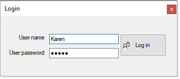

# MS-Access login

This repository contains basic code to prompt a user for user name and password to login to a Microsoft Access database which has a database password. 

Although the focus is on login, there is also code which has not been implemented to add a new user and update a user’s password.

### Encryption notes
In this code sample MS-Access databases are encrypted. When working with your own database and connections fail, make sure to try the following.
- Open Access in exclusive mode.
- Under the file menu, options.
- Find client settings.
- At the bottom of settings.
- Change  Encryption Method at the bottom. Change to selection to Use Legacy Encryption.

Also there have been reports of encryption failing with passwords longer than 14 characters.